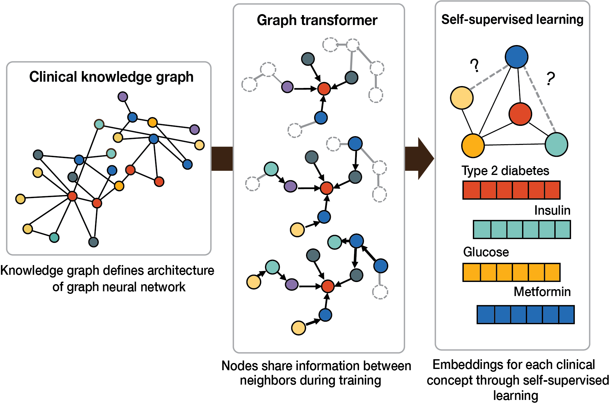

# Unified Clinical Vocabulary Embeddings for Advancing Precision Medicine

## Overview

These clinical knowledge embeddings provide a standardized resource for 
formally integrating clinical knowledge into clinical AI models. 
We constructed a data-driven resource consisting of over 67,124 clinical vocabulary embeddings 
derived from a clinical knowledge graph specifically suited to EHR vocabularies with over 1.3 million edges. 
Using state-of-the-art graph transformer neural networks, we generated high-dimensional, machine-readable representations 
of each clinical concept. This resource offers a hypothesis-free approach to generating rich representations of clinical
 knowledge across 7 different medical vocabularies without any dependence on patient-level information. 



## Installation and setup

Depending on what level of analysis you're performing, you may not need to install the full list of packages.

### "I just want the KG and/or embeddings"
No need to install any dependencies. Please download the embeddings from Harvard Dataverse [here](https://dataverse.harvard.edu/dataset.xhtml?persistentId=doi:10.7910/DVN/Z6H1A8).

### "I just want the scripts to construct the KG from the source files"

This only requires the following standard libraries. For this step, the exact version is not typically a strict requirement. 

```
dgl==1.1.3+cu118
pandas==2.2.2
numpy==1.24.4
```

Navigate to `kg/` where `construct_kg.ipynb` will walk through downloading all of the source files and constructing the knowledge graph from scratch. Note that due to licensing, users will be required to register and download certain source files (e.g. LOINC codes). 

### "I want to train and create embeddings from scratch"

This requires installing ML graph-specific libraries. We've provided the conda environment below. Note that the version requirement for DGL (Deep Graph Library) is very specific (v1.1)

Follow the previous step above to construct the KG or download the KG csv from Harvard Dataverse [here](https://dataverse.harvard.edu/dataset.xhtml?persistentId=doi:10.7910/DVN/Z6H1A8). The model source code and scripts for training are provided in `model/`.

### "I want to recreate the entire paper because I liked it so much"

Thank you for the flattery. We've provided individual Jupyter notebooks for each of the main analyses presented in the paper under `analyses/`. You will need to download the embeddings and associated key file (mapping indices to node names) here and change the file location at the top of each notebook.

Note that we provide a modified version of the phenotype risk score analysis using synthetic data since this analysis requires individual-level patient data. 
